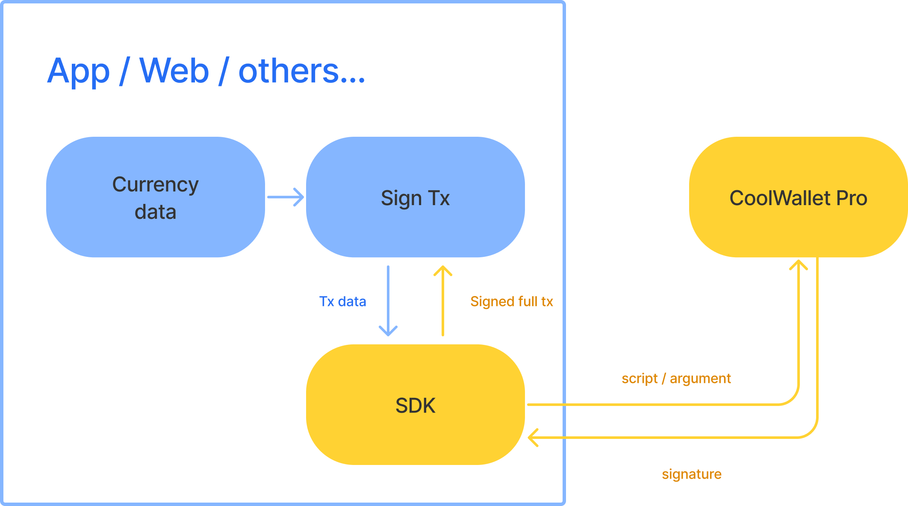

## Abstract

This document will guide you how to integrate new crypto currency into CoolWallet Pro, starting from signing script to SDK development.

## Introduction

In order to facilitate new crypto currency integration, we have designed a new script language that allows developers to write a script to compose signature generation. The script could accept arguments to generate the signature.
CoolWallet Pro involves complex Application Protocol Data Unit (APDU) commands, and deals with various cryptographic algorithms for security consideration. To facilitate the development experience, we wrap the communication protocol as a core package in the SDK, so developers just need to focus on developing the logic of new crypto currency.

## What is Signing Script 

As mentioned above, the signing script is a script language developed for CoolWallet Pro to process and compose the signatures for later broadcasting transactions to blockchain. We provide a separate tool in this [repository](https://github.com/CoolBitX-Technology/coolwallet-signing-tools) and please refer to it for more information.
## What is CoolWallet SDK

CoolWallet SDK is a set of tools for app developers to easily communicate with CoolWallet Pro for key management and signature generation. The SDK itself supports more than 10 crypto currencies (and the number is increasing), and it also encapsulates all the communication commands required with CoolWallet Pro.

The relationship between CoolWallet Pro and CoolWallet SDK is shown in the figure below：



CoolWallet SDK is designed to incorporate community support. We welcome community effort to help add more crypto currencies in the SDK. In the following paragraphs we will provide more detail about how to contribute to CoolWallet SDK.

## Prerequisite

* Favorite IDE that supports TypeScript
* PC/notebook with bluetooth connectivity
* CoolWallet Pro
* Blockchain API of the crypto currency you want to develop
	* CoolWallet SDK does not handle transaction broadcasting to blockchain. To test the correctness of the signature, you may need to have API access to actually broadcast the transaction.
* Signing script

## Steps

### Create a package for the crypto currency


Folder name should follow the rule: coin-(symbol)
	
### According to the currency nature, you may need to implement ECDSA or EDDSA class and required functions, getAddress(), and signTransaction().

[coin-xrp/src/index.ts](./packages/coin-xrp/src/index.ts)

```javascript
export default class XRP extends COIN.ECDSACoin implements COIN.Coin{
  constructor() {
    super(params.COIN_TYPE);
  }
```
The coin type in constructor is defined in [BIP-0044](https://github.com/satoshilabs/slips/blob/master/slip-0044.md).

### Implement getAddress function
 
[coin-xrp/src/index.ts](./packages/coin-xrp/src/index.ts)

```javascript
async getAddress(transport: types.Transport, appPrivateKey: string, appId: string, addressIndex: number): Promise<string> {
    const publicKey = await this.getPublicKey(transport, appPrivateKey, appId, addressIndex);
    return txUtil.pubKeyToAddress(publicKey);
  }
```
The transport, appPrivateKey, appId are descriped in [README.md](./README.md).

### Implement signTransaction

[coin-xrp/src/index.ts](./packages/coin-xrp/src/index.ts)
	
```javascript
 async signTransaction(
    signTxData: types.signTxType
  ) {
    const payment = signTxData.payment;

    payment.TransactionType = "Payment";
    payment.Flags = 2147483648;
    if (!payment.SigningPubKey) {
      payment.SigningPubKey = await this.getPublicKey(signTxData.transport, signTxData.appPrivateKey, signTxData.appId, signTxData.addressIndex);
      payment.SigningPubKey = payment.SigningPubKey.toUpperCase();
    }
    if (!payment.Account) {
      payment.Account = txUtil.pubKeyToAddress(payment.SigningPubKey);
    }

    return xrpSign.signPayment(
      signTxData,
      payment,
    );
  }
```

[coin-xrp/src/sign.ts](./packages/coin-xrp/src/sign.ts)

```javascript
import { apdu, tx } from "@coolwallet/core";

export const signPayment = async (
  signTxData: types.signTxType,
  payment: types.Payment
): Promise<string> => {

  const { transport, addressIndex, appId, appPrivateKey, confirmCB, authorizedCB } = signTxData

  const script = params.TRANSFER.script + params.TRANSFER.signature;
  const argument = await scriptUtil.getPaymentArgument(addressIndex, payment);

  const preActions = [];
  const sendScript = async () => {
    await apdu.tx.sendScript(transport, script);
  }
  preActions.push(sendScript);

  const sendArgument = async () => {
    return apdu.tx.executeScript(
      transport,
      appId,
      appPrivateKey,
      argument
    );
  }

  const signature = await tx.flow.getSingleSignatureFromCoolWallet(
    transport,
    preActions,
    sendArgument,
    false,
    confirmCB,
    authorizedCB,
    false
  );
  return txUtil.generateRawTx(signature.toString('hex'), payment);
};
```

* The **script** in above code is generated in  [coolwallet-signing-tools](https://github.com/CoolBitX-Technology/coolwallet-signing-tools), and **signature** is
signed by CoolBitX team. In development stage, you can use "FA0000000000000000000000000000000000000000000000000000000000000000000000000000000000000000000000000000000000000000000000000000000000000000000000" replace first, if you have development card.
* Notice the tx.flow.getSingleSignatureFromCoolWallet will return DER encode signature only. If you want another form signature, like canonical signatures, r s v, etc. You should implement here.
* The function should return full transaction which can be broadcast to blockchain.
* Use web-demo page (still under development) to test full flow to make sure signing flow is correct.

### If the currency has extra functionalities
* For example, smart contracts, staking, etc. You may need to implement additional functions as well.

### Once you finish the development of new crypto currency, you may want to test the functionalities. Here are some suggested test cases.
* Check the address created by getAddress() function and compare it with official tools (CLI, or API).
* When performing the signature generation, make sure the information shown on CoolWallet Pro is correct. The information includes the blockchain symbol,token name (if it is a token transaction), addresses, and amount.
* Finally check if the transaction (combined with generated signature) could be broadcasted to the blockchain successfully.
* 
 
### If everything goes well, you’re encouraged to create a pull request to the repository. CoolBitX engineering team will help to review it.